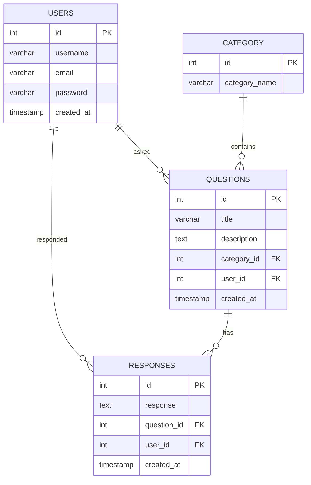

# Discuss

This project is a platform where users can ask and answer questions about different technical and mechanical topics, like programming, electronics, robotics, and more. Users can sign up, choose a category, ask questions, and get help from others users can also delete their questions. The platform keep track of all questions and responses(answer), making it easy to share knowledge.

## Features

- User authentication
- Question sorting by recent
- Category-wise sorting
- User-wise sorting
- My Question
- Delete Question
- Search Question (title/description)

## Tech Stack

**Client:** HTML, Bootstrap, CSS, Vanilla JS

**Server:** PHP, PostgreSQL

## Security Measures

- Input sanitization using `htmlspecialchars` To avoid XSS
- Password hashing using `Bcrypt`

## Important SQL Queries

- To fetch questions sorted by the number of responses in descending order:

```sql
SELECT q.id, c.category_name, q.title, q.description, users.username AS user, q.created_at, COUNT(r.id) AS responses
FROM questions q
JOIN category c ON q.category_id = c.id
JOIN users ON q.user_id = users.id
LEFT JOIN responses r ON q.id = r.question_id
GROUP BY q.id
ORDER BY responses DESC;
```

## Database Diagram

- The following diagram illustrates the relationships between the tables in the database:

### Tables and Relationships

1. **Users**

   - **Table Name**: `discuss.public.users`
   - **Description**: Stores user information.

2. **Questions**

   - **Table Name**: `discuss.public.questions`
   - **Description**: Contains all the questions asked by users.
   - **Relationships**:
     - References **Category** (`category_id`)
     - References **Users** (`user_id`)

3. **Responses**

   - **Table Name**: `discuss.public.responses`
   - **Description**: Holds responses to the questions.
   - **Relationships**:
     - References **Questions** (`question_id`)
     - References **Users** (`user_id`)

4. **Category**
   - **Table Name**: `discuss.public.category`
   - **Description**: Contains the categories for questions.
   - **Relationships**:
     - Referenced by **Questions** (`category_id`)

### Diagram Representation



## Installation

- Clone the repository.
- Install the required PHP dependencies using Composer:

```bash
composer install
```

- Set up the database by running the provided SQL scripts.
- Configure the database connection in `.env`.
- Set up a local development environment (Laragon recommended).
- Start the local server.
